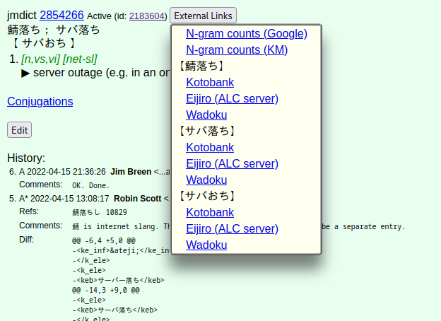
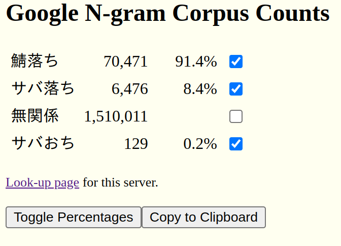
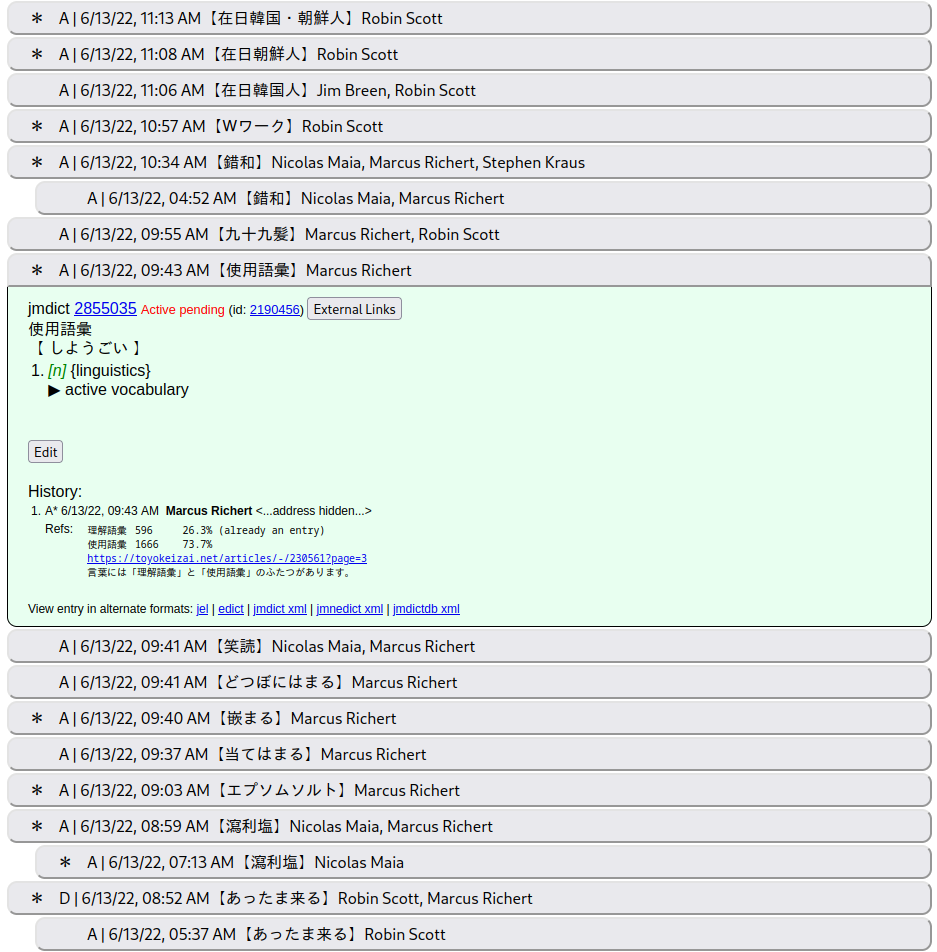

# EDRDG Scripts
This is a collection of client-side scripts for improving the
usability of [edrdg.org](https://www.edrdg.org/).

These programs can be imported into and launched via a
[userscript manager](https://en.wikipedia.org/wiki/Userscript_manager)
such as [Greasemonkey](https://en.wikipedia.org/wiki/Greasemonkey) or
[Violentmonkey](https://violentmonkey.github.io/).

These are third-party scripts written by myself and not officially endorsed by or
affiliated with the Electronic Dictionary Research and Development Group.

## JMdictDB External Links [[Demo](https://stephenmk.github.io/jmdictdb/link_menu_demo.html)][[Install](https://github.com/stephenmk/edrdg-scripts/raw/main/jmdictdb_ext_link_menu.user.js)]

This script adds a menu of external links to JMdictDB entries.

  
Example image

  

## N-gram Term Combinations [[Install](https://github.com/stephenmk/edrdg-scripts/raw/main/ngram_group_parser.user.js)]

This script adds a new syntax to the N-gram term lookup pages. An
expression such as `｛思う／おもう｝｛壺／ツボ／つぼ／壷｝` can be
expanded into eight search terms, i.e., the eight different
combinations of 思う and おもう with 壺, ツボ, つぼ, and 壷.

Parentheses and curly braces can be used to enclose the groups. Comma,
period, semicolon, and ／ characters can be used as delimiters within
the groups.

One pitfall to be mindful of is that the N-gram server will fail if too many terms (~100) are queried at once.

  
Example video

  

## N-gram Corpus Count Percentages [[Demo](https://stephenmk.github.io/jmdictdb/corpus_counts_demo.html)][[Install](https://github.com/stephenmk/edrdg-scripts/raw/main/corpus_count_percentages.user.js)]

This script adds extra controls to the "N-gram Corpus Count" result pages.

* Checkboxes to control which counts are included in the percentage
  calculation

* A button to sort results in descending order (and kanji forms before
  kana forms)

* A button to toggle all of the percentage checkboxes

* A button to copy the table to the user's clipboard in a
  space-aligned text format

  
Example image

  

## JMdictDB Collapsible Entries [[Demo](https://stephenmk.github.io/jmdictdb/updates_demo.html)][[Install](https://github.com/stephenmk/edrdg-scripts/raw/main/jmdictdb_collapsible_updates.user.js)]

This script makes the entries on the daily updates page collapsible
underneath buttons which display entry summaries. The entries are
sorted in descending order by update time, and parent entries are
threaded underneath their child entries. This may not work well on
mobile devices.

  
Example image

  

# License
Following the example of the [JMdictDB server software](https://gitlab.com/yamagoya/jmdictdb),
this software is licensed under the GNU General Public License version 2 or (at your option)
any later version. See the file `LICENSE` for details.
