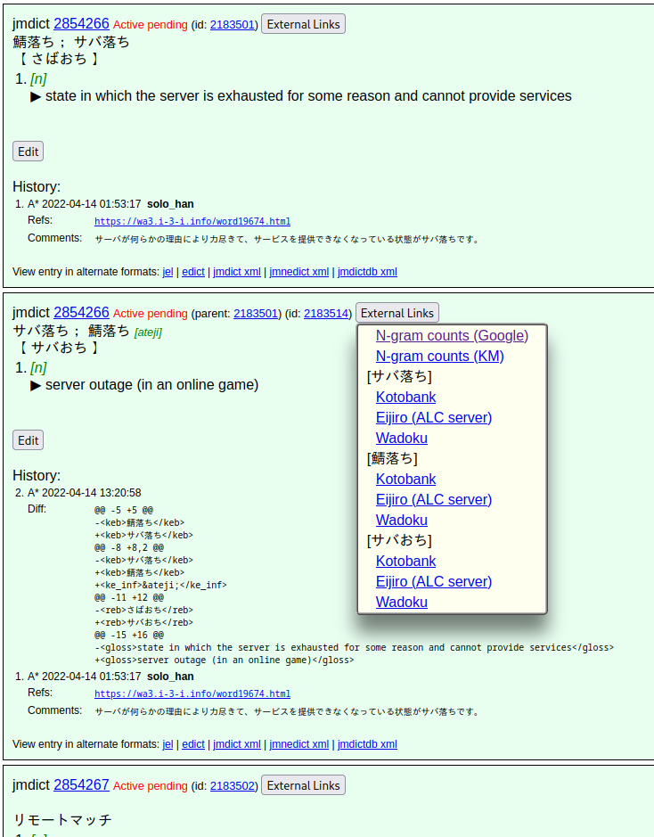
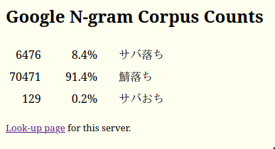

# EDRDG Scripts
This is a collection of client-side scripts for improving the usability of [edrdg.org](https://www.edrdg.org/).
These programs can be imported into and launched via a [userscript manager](https://en.wikipedia.org/wiki/Userscript_manager)
such as [Greasemonkey](https://en.wikipedia.org/wiki/Greasemonkey). 

### JMdictDB external links
This script adds a menu of external links to JMdictDB entries. 

  
Example image

  
  

### N-gram Corpus Count Percentages
This script adds usage percentages to the tables on the "N-gram Corpus Count" pages. It also adds an
appropriate amount of whitespace to each cell so that the data will align nicely when copied and
pasted into JMdictDB reference notes.

  
Example image

  
  

## License
Following the example of the [JMdictDB server software](https://gitlab.com/yamagoya/jmdictdb),
this software is licensed under the GNU General Public License version 2 or (at your option)
any later version. See the file LICENSE.txt for details.
